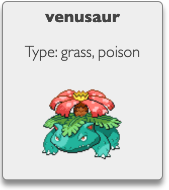

#  R.4.01 Développement Web - JavaScript

### IUT Montpellier-Sète – Département Informatique

## TD6

#### _Thème : *AJAX*, promesses et async/await_

Commencez par `git clone` le *fork* du TD6 que nous avons fait pour vous. Ce
*fork* doit se trouver dans
https://gitlabinfo.iutmontp.univ-montp2.fr/r4.01-developpementweb/etu/votre_login_IUT/TD6

## Introduction

Nous allons voir ici les différentes techniques et syntaxes qui ont été ajoutées au langage pour faciliter l'utilisation de l'asynchronisme et notamment de l'envoi de requêtes HTTP.

Le but de cet exercice est de réaliser une page qui affiche des informations sur des *pokémon* en interrogeant l'[API Pokémon](https://pokeapi.co) pour obtenir les données demandées par l'utilisateur.

### Présentation des *pokémon* et de l'API

Les *pokémon* sont les créatures fictives présentes dans la franchise du même nom créées en 1996.

Les *pokémon* sont classés en *espèces*, chaque espèce pouvant correspondre à plusieurs *pokémon* (différentes *variétés* de la même espèce). Par ailleurs, il y a un système d'évolution qui permet aux *pokémon* de certaines espèces d'évoluer en une autre espèce.

Par exemple, les *pokémon* de l'espèce [Charmander](https://bulbapedia.bulbagarden.net/wiki/Charmander) peuvent évoluer en [Charmeleon](https://bulbapedia.bulbagarden.net/wiki/Charmeleon) et l'espèce Charmeleon peut à son tour évoluer en [Charizard](https://bulbapedia.bulbagarden.net/wiki/Charizard).

La plupart du temps cette « chaine d'évolution » est linéaire, mais il existe des cas plus complexes où une même espèce peut évoluer en plusieurs espèces différentes (par exemple [Eevee](https://bulbapedia.bulbagarden.net/wiki/Eevee) peut évoluer en 8 espèces différentes).

Dans cet exercice, nous afficherons des informations sur les différentes espèces sous la forme d'une carte indiquant le nom de l'espèce, ainsi que l'image et les types de sa variété par défaut :




Nous utiliserons [l'API Pokémon](https://pokeapi.co) qui permet d'obtenir des informations (très) détaillées sur les différents *pokémon*. On peut faire plusieurs types de requêtes à l'API. Nous utiliserons en particulier trois types de requêtes :

- [Pokemon](https://pokeapi.co/docs/v2#pokemon) : informations correspondant à un *pokémon* particulier (par nom ou numéro)
    - `https://pokeapi.co/api/v2/pokemon/{id or name}/`
    - Fragment de la réponse à la requête `https://pokeapi.co/api/v2/pokemon/charizard/` :
    ```json
        {
            "id": 6,
            "is_default": true,
            "name": "charizard",
            "species": {"name": "charizard", "url": "https://pokeapi.co/api/v2/pokemon-species/6/"},
            "sprites": {
                "front_default": "https://raw.githubusercontent.com/PokeAPI/sprites/master/sprites/pokemon/6.png",
            },
            "types": [
                {
                    "slot": 1, 
                    "type": {"name": "fire", "url": "https://pokeapi.co/api/v2/type/10/"}
                },
                {
                    "slot": 2, 
                    "type": {"name": "flying", "url": "https://pokeapi.co/api/v2/type/3/"}
                },
            ],
        }
    ```
    - C'est cette requête qui permet d'obtenir le sprite à afficher (il y en a plusieurs, on affichera celui qui correspond à `front_default`) et les types du *pokémon*.

- [Pokemon Species](https://pokeapi.co/docs/v2#pokemon-species) : informations concernant une *espèce* de *pokémon*
    - `https://pokeapi.co/api/v2/pokemon-species/{id or name}/`
    - Il peut y avoir plusieurs *pokémon* qui correspondent à une même *espèce* (ici par exemple l'espèce *charizard* a 4 variétés *charizard*, *charizard-mega-x*, *charizard-mega-y* et *charizard-gmax*) mais il y a toujours une unique variété par défaut (celle avec l'attribut `is_default: true`, qui est probablement toujours la première de la liste).
    - Fragment de la réponse à la requête `https://pokeapi.co/api/v2/pokemon-species/charizard/` :
        ```json
        {
            "evolution_chain": {"url": "https://pokeapi.co/api/v2/evolution-chain/2/"},
            "evolves_from_species": {"url": "https://pokeapi.co/api/v2/evolution-chain/2/"},
            "name": "charizard",
            "varieties": [
                {
                    "is_default": true,
                    "pokemon": {"name": "charizard", "url": "https://pokeapi.co/api/v2/pokemon/6/"}
                },
                {
                    "is_default": false,
                    "pokemon": {"name": "charizard-mega-x", "url": "https://pokeapi.co/api/v2/pokemon/10034/"}
                },
                {
                    "is_default": false, 
                    "pokemon": {"name": "charizard-mega-y", "url": "https://pokeapi.co/api/v2/pokemon/10035/"}
                },
                {
                    "is_default": false, 
                    "pokemon": {"name": "charizard-gmax", "url": "https://pokeapi.co/api/v2/pokemon/10196/"}
                }
            ],
        }
        ```
    - Cette requête permet de trouver le lien pour obtenir la chaîne d'évolution de l'espèce recherchée

- [Evolution Chains](https://pokeapi.co/docs/v2#evolution-chains) : informations concernant les chaînes d'évolution des espèces
    - `https://pokeapi.co/api/v2/evolution-chain/{id}/`
    - Représente un arbre d'espèces. Chaque nœud a un attribut `species` qui représente une espèce et un attribut `evolves_to` qui contient une liste de nœuds correspondant aux évolutions possibles de l'espèce (la liste est vide si l'espèce n'a pas d'évolution possible).
    - Fragment de la réponse à la requête `https://pokeapi.co/api/v2/evolution-chain/2/` :
        ```json
        {
            "id": 2,
            "chain": {
                "species": {
                    "name": "charmander", 
                    "url": "https://pokeapi.co/api/v2/pokemon-species/4/",
                },
                "evolves_to": [
                    {
                        "species": {
                            "name": "charmeleon",
                            "url": "https://pokeapi.co/api/v2/pokemon-species/5/",
                        },
                        "evolves_to": [
                            {
                                "species": {
                                    "name": "charizard",
                                    "url": "https://pokeapi.co/api/v2/pokemon-species/6/",
                                },
                                "evolves_to": [],
                            }
                        ],
                    },
                ],
            },
        }
        ```

### Affichage d'un *pokémon*

Dans les fichiers fournis dans ce TD, on a implémenté un bouton qui envoie une requête à l'API pour chercher un *pokémon* et affiche une carte avec les informations basiques du *pokémon* (nom, sprite et types). Cette tâche est assez simple car il suffit d'une seule requête *AJAX* pour obtenir les informations nécessaires et afficher la carte.

1. Regardez le contenu des fichiers `index.html`, `js/script-base.js` et `js/script-xhr.js` du répertoire `src` pour comprendre le fonctionnement initial de la page (la fonction `getSpeciesUrls` n'est pas utile au début, elle servira dans la partie suivante).

## Affichage des chaînes d'évolution

Le but de ce TD est d'implémenter une fonctionnalité plus complexe qui, lorsque l'utilisateur cherche une espèce de *pokémon* (par nom ou id) et appuie sur le bouton "Ajouter évolutions", affiche toutes les espèces de la chaîne d'évolution de l'espèce choisie. Par exemple si l'utilisateur entre le nom « charmeleon », puis clique sur le bouton, la page doit ajouter les cartes de *charmander*, *charmeleon* et *charizard*.

**Remarque :** [Pour simplifier](https://xkcd.com/2587/), on n'affichera que les informations du *pokémon* de la variété par défaut (attribut `is_default: true`) de chaque espèce. Par contre, on affichera toutes les espèces de la « chaîne », qui a parfois la structure d'un arbre comme la chaîne d'évolution de [*eevee*](https://bulbapedia.bulbagarden.net/wiki/Eevee) ou [les autres *pokémon* ayant plusieurs branches d'évolution](https://bulbapedia.bulbagarden.net/wiki/List_of_Pokémon_with_branched_evolutions)).


Étant donné un nom d'espèce de *pokémon* (ou un *id*), il faut donc :
- **faire une requête** sur l'espèce demandée
- **faire une requête** sur la chaîne d'évolution de l'espèce (on peut utiliser l'attribut `evolution_chain.url` des données de l'espèce)
- parcourir toutes les espèces dans la chaîne d'évolution, et pour chaque espèce :
    - **faire une requête** pour obtenir les données de l'espèce
    - trouver le *pokémon* par défaut en parcourant les éléments dans l'attribut `varieties` pour trouver celui qui a un attribut `is_default` vrai (vous pouvez aussi probablement prendre le premier élément dans `varieties`, même s'il n'est pas explicitement dit que c'est toujours celui par défaut)
    - appeler la fonction `addPokemon` pour afficher la carte correspondante

**Remarque :** Dans toute la suite, nous allons lancer en parallèle les requêtes pour obtenir les données correspondant aux espèces de la chaîne d'évolution. Cela signifie que les réponses ne vont pas nécessairement arriver dans l'ordre, ce qui fait que l'affichage sur la page ne correspondra pas toujours à l'ordre réel de la chaîne d'évolution. Étant donné que le but est ici de voir comment utiliser des séries d'appels asynchrones, dans un premier temps nous allons ignorer ce problème et considérer qu'on veut simplement afficher toutes les espèces de la chaîne indépendamment de leur ordre.


### XMLHttpRequest

Dans un premier temps, nous allons écrire la fonction `addEvolutionChain` en utilisant directement des objets `XMLHttpRequest`, comme vu dans les TD précédents.

2. Dans le fichier `script-xhr.js`, en vous inspirant de la fonction `addPokemon`, complétez la fonction `addEvolutionChain` qui affiche les cartes de toutes les espèces de la chaîne d'évolution du *pokémon* passé en argument.
   
   **Indications :** 
   1. Pour énumérer toutes les espèces d'une chaîne d'évolution, vous pouvez utiliser la fonction récursive `getSpeciesUrl` du fichier `script-base.js`. Il faut lui passer le premier nœud de la chaîne, c'est-à-dire l'attribut `chain` de l'objet renvoyé par la requête correspondant à une chaîne d'évolution).
      Sur l'exemple précédent de la chaîne d'évolution 2, `getSpeciesUrls(json.chain)` renvoie 
      ```js
      ['https://pokeapi.co/api/v2/pokemon-species/4/', 'https://pokeapi.co/api/v2/pokemon-species/5/', 'https://pokeapi.co/api/v2/pokemon-species/6/']
      ```
   
   2. Il y a 3 requêtes différentes à écrire dont une qui est dans une boucle qui sera donc exécutée plusieurs fois (il y a aussi une quatrième requête cachée dans l'appel à `addPokemon`). Vous pouvez soit tout écrire en un seul bloc c'est-à-dire que la création et l'appel de la seconde requête se trouvent dans le *callback* de la première requête, et que la création et l'appel de la troisième requête se trouvent dans le *callback* de la seconde (qui est lui-même dans le *callback* de la première) ou bien définir des fonctions de *callback* nommées séparées qui s'appellent entre elles.

### Promesses et `fetch`

Bien que la classe `XMLHttpRequest` soit très pratique pour faire des requêtes asynchrones sans avoir à recharger intégralement la page, le code écrit pour la question précédente montre qu'il est rapidement fastidieux d'écrire un enchaînement de requêtes. Si on veut utiliser des fonctions anonymes pour chaque *callback*, il faut imbriquer les codes des appels successifs les uns dans les autres ce qui amène rapidement à un niveau de profondeur élevé difficile à lire (cf. *callback hell* ou *pyramid of doom*).

Pour corriger ce problème, le standard *ECMAScript 2015* a introduit la notion de *promesse*, implémentée par la classe [`Promise`](https://developer.mozilla.org/fr/docs/Web/JavaScript/Reference/Global_Objects/Promise). Une promesse est un objet qui représente une valeur qui n'est pas immédiatement disponible (par exemple le résultat d'une requête GET). La promesse peut être dans 3 états :
- *en attente* (*pending*) : la valeur n'est pas encore disponible
- *tenue* (*fulfilled*) : la promesse est résolue et la valeur est disponible
- *rompue* (*rejected*) : la promesse est résolue mais la valeur n'a pas pu être obtenue (erreur)

L'intérêt principal des promesses est que les fonctions dont le résultat n'est pas encore disponible peuvent renvoyer immédiatement une promesse représentant ce résultat et le programme peut ainsi poursuivre son exécution. On peut ensuite attacher des *callbacks* à la promesse, qui seront exécutés automatiquement quand la promesse sera résolue : un callback à exécuter avec la valeur si la promesse est tenue et un autre à exécuter en cas d'erreur si la promesse est rompue. Si l'on a une promesse `p`, on peut appeler sa méthode `p.then` en lui passant en argument une fonction qui indique ce qu'il faudra faire avec la valeur lorsqu'elle sera disponible :

```js
p.then(value => {
    console.log(`La valeur calculée est ${value}`);
});
```

La fonction passée à `then` peut également renvoyer une valeur. Dans ce cas, comme la valeur ne sera disponible que plus tard (lorsque la promesse initiale sera résolue), l'appel à la fonction `then` renvoie également une promesse, représentant cette nouvelle valeur qui sera disponible plus tard. Cela signifie qu'on peut enchaîner les appels à `then` pour appliquer des transformations successives :

```js
p.then(value => {
    console.log(`valeur reçue : ${value}`);
    return value + 1;
}).then(value => {
    console.log(`valeur incrémentée de 1: ${value}`);
    return value * 2;
}).then(value => {
    console.log(`valeur précédente doublée: ${value}`);
});
```

De manière similaire, on peut appeler la méthode `catch` d'une promesse et lui passer une fonction à exécuter en cas d'échec de la promesse.

Un des avantages de cette présentation est que les différents *callbacks* successifs sont écrits les uns après les autres et non plus de manière imbriquée comme c'était le cas avec les `XMLHttpRequest`. Dans ce cas particulier, pour faire des requêtes `GET` ou `POST` asynchrones, il existe une fonction `fetch` qui exécute une requête vers un URL passé en argument et renvoie une promesse représentant les données obtenues. Un léger inconvénient est que la valeur renvoyée par la promesse n'est pas directement un objet *Javascript* obtenu en interprétant du *JSON* mais un tableau d'octets. Pour interpréter le résultat de la requête comme du *JSON* et en faire un objet *Javascript* on peut utiliser la méthode `json()` sur le résultat de `fetch`, qui renvoie à son tour une promesse :

```js
fetch("http:// ... /")
    .then(
        data => data.json()
        // ou de façon équivalente 
        // data => { return data.json()}
        // ou encore
        // function (data) { return data.json()}
    )       
    .then(data => {
        // faire quelque chose avec les données obtenues
        console.log(`données reçues: ${data}`);
    });
```

3. Dans le fichier `script-fetch.js`, en vous inspirant de la fonction `addPokemon`, écrivez la fonction `addEvolutionChain` en utilisant la fonction `fetch` et la méthode `.json()` pour décoder les réponses aux requêtes. Modifiez la balise `<head>` du fichier `index.html` pour qu'il appelle `script-fetch.js` au lieu de `script-xhr.js`.


### Construction de promesses

La plupart du temps il n'est pas nécessaire de construire directement des promesses car on utilise plutôt des fonctions qui renvoient des promesses toutes faites (comme on vient de le faire avec `fetch`). Toutefois, si l'on souhaite créer directement une promesse, on peut appeler le constructeur de la classe *Promise* en lui passant en argument une fonction qui prend deux arguments `resolve` et `reject`. Cette fonction décrit les actions à réaliser pour obtenir la valeur attendue. Lorsque la valeur est obtenue, la fonction de la promesse doit appeler `resolve(valeur)` pour rendre la valeur disponible. Si une erreur se produit, la fonction doit appeler `reject(erreur)` pour que la promesse soit rompue.

Par exemple :

```js
// nouvelle promesse à partir du constructeur
const p = new Promise((resolve, reject) => {
    const x = Math.random();
    
    // simulation d'une action asynchrone qui met 2s à se résoudre
    setTimeout(() => {
        if (x >= .5) {
            // la promesse est résolue et une valeur est renvoyée
            resolve("All your base are belong to us!");
        } else {
            // la promesse est rompue, une erreur est renvoyée
            reject(new Error("They have set us up the bomb!"));
        }
    }, 2000);
});

// exemple d'utilisation
p.then((value) => {
    console.log(value);
}).catch((error) => {
    console.log(error.message);
})
```

4. Ouvrez le fichier `script-promise.js` et complétez la fonction `getData`.

    Cette fonction doit utiliser un objet `xhr` de type `XMLHttpRequest` pour exécuter une requête GET sur l'URL passé en argument (comme on le faisait avant). Dans le *callback* de `xhr`, il faut décoder les données obtenues à l'aide de `JSON.parse` et appeler `resolve` en lui passant les données décodées. Vous pouvez optionnellement utiliser l'attribut `xhr.status` pour détecter les éventuelles erreurs (si `xhr.status != 200`) et appeler `reject` dans ce cas.

5. En vous inspirant de la fonction `addPokemon` (du fichier `script-promise.js`), écrivez la fonction `addEvolutionChain` en utilisant la méthode `getData`. Mettez à jour la balise `<head>` du fichier `index.html` pour appeler `script-promise.js`.
    
    **Indication :** Cette fonction est très similaire à la version précédemment écrite en utilisant `fetch`, mais légèrement plus simple puisque les promesses renvoyées par `getData` correspondent déjà à des objets JSON décodés.


## Async / Await

La dernière nouveauté de *Javascript* en termes de tâches asynchrones est l'introduction des deux mots-clés `async` et `await` qui servent à définir des [*fonctions asynchrones*](https://developer.mozilla.org/fr/docs/Web/JavaScript/Reference/Statements/async_function) et simplifient la rédaction de programmes utilisant des promesses.

> Une fonction asynchrone est une fonction précédée par le mot-clé `async`, et qui peut contenir le mot-clé `await`. `async` et `await` permettent un comportement *asynchrone*, basé sur une promesse (`Promise`), écrite de façon simple, et évitant de configurer explicitement les chaînes de promesse.

Une fonction asynchrone renvoie toujours une promesse (si l'objet renvoyé dans le code n'est pas une promesse il est automatiquement « enveloppé » dans une promesse). Dans le corps d'une fonction asynchrone, on peut utiliser le mot-clé `await` devant une expression qui renvoie une promesse pour indiquer à la fonction d'attendre que la promesse soit résolue et d'utiliser la valeur contenue dans la promesse pour poursuivre son exécution. Cela permet donc de réaliser un enchaînement de promesses de manière plus naturelle.

Par exemple :
```js
async function get(url) {
    // envoie une requête fetch et attend que le résultat soit disponible
    const response = await fetch(url);
    // attend le résultat de response.json()
    const data = await response.json();
    // attend le résultat d'un second fetch (qui dépend du résultat du premier)
    const response2 = await fetch(data.url);
    // renvoie le résultat sous forme d'une promesse
    return response2.json();
}

const p = get("http:// ... /");     // le résultat de get() est une promesse
p.then(data => console.log());      // on peut attendre la résolution de la promesse avec then
```

Il est également possible de rattraper les erreurs levées par une promesse qui a été rejetée pendant un `await` avec un bloc `try ... catch` :

```js
async function get(url) {
    try {
        const response = await fetch(url);
        return await response.json();
    } catch (error) {
        // si une promesse est rejetée pendant un await, une exception est levée contenant l'erreur de la promesse
        console.log("Erreur :" + error);
    }
}
```

6. Dans le fichier `script-await.js`, en vous inspirant de la fonction `addPokemon(nameOrIndex)`, écrivez la fonction asynchrone `addEvolutionChain(nameOrIndex)` en utilisant `await`. Modifiez la balise `<head>` du fichier `index.html` pour qu'il appelle `script-await.js`.
   
   **Indications :** 
   1. Vous pouvez utiliser `fetch()` et `.json()` comme si c'étaient des fonctions séquentielles en utilisant le mot clé `await` (le code de la fonction attend que le résultat soit disponible avant de continuer, mais la fonction ne bloque pas l'exécution d'autres parties du code qui pourraient s'exécuter en parallèle (par exemple la gestion d'événements, ou d'autres fonctions asynchrones)).
   2. Remarquez que la fonction `addPokemon` de `script-await.js` est `async`. C'est obligatoire car cette fonction utilise `await`.  

## (Bonus) Parallélisme ordonné

Comme indiqué dans une remarque en début de sujet, lorsqu'on lance toutes les requêtes correspondant aux différentes espèces d'une chaîne d'évolution en parallèle, il est possible que les réponses n'arrivent pas dans l'ordre des requêtes. Comme l'affichage sur la page se fait au moment où les réponses sont obtenues, il est possible que les *pokémon* ne soient pas affichés dans l'ordre de leur chaîne d'évolution.

Une première solution est d'exécuter séquentiellement le traitement des différentes espèces de la chaîne d'évolution (les URL renvoyées par `getSpeciesUrl()`). On peut en effet faire une boucle qui pour chaque URL, lance la requête et attend que les données aient été intégralement traitées et la carte correspondante affichée avant de passer à l'URL suivant.

7. Modifiez une des versions de la fonction `addEvolutionChain(nameOrIndex)` pour qu'elle traite séquentiellement les différentes espèces qui apparaissent dans la chaîne d'évolution.
   
   **Indication :** A priori, c'est la version avec `async`/`await` qui est la plus simple à modifier ainsi (la version que vous avez écrite précédemment vérifie peut-être déjà cette propriété). 
   <!-- Essayez de modifier également une autre version, par exemple celle avec des promesses, pour qu'elle exécute les requêtes séquentiellement. -->

L'inconvénient de la solution séquentielle est qu'elle ne profite pas du fait qu'on peut envoyer toutes les requêtes en parallèle. En effet, toutes les requêtes au réseau sont envoyées l'une après l'autre (la durée totale est donc la somme des durées de chaque requête) alors qu'on pourrait les envoyer toutes en même temps (la durée totale serait alors la durée de la plus longue requête), et traiter les réponses obtenues séquentiellement.

8. Modifiez encore la fonction `addEvolutionChain(nameOrIndex)` pour qu'elle lance toutes les requêtes en parallèle, mais qu'elle affiche les cartes correspondant aux différents *pokémon* de la chaîne dans le bon ordre.

    **Indication :** Le plus simple ici est d'utiliser une version hybride qui utilise `async`/`await` pour les requêtes qui se font séquentiellement au début. Ensuite, lorsqu'on obtient les URL de toutes les espèces dans la chaîne d'évolution il faut exécuter les requêtes qui permettent d'obtenir les données que chaque *pokémon* de la chaîne sous forme d'un tableau de promesses (une promesse pour chaque *pokémon* de la chaîne). On attend ensuite la résolution de toutes les promesses du tableau, et quand elles sont toutes prêtes on appelle séquentiellement la fonction `addPokemonCard` sur chaque valeur renvoyée.

    Vous pouvez en particulier chercher comment utiliser [`Promise.all`](https://developer.mozilla.org/fr/docs/Web/JavaScript/Reference/Global_Objects/Promise/all) pour attendre que toutes les promesses d'une liste soient résolues et obtenir toutes leurs valeurs.


## (Bonus) Utilisation de la balise `<template>`

La fonction `addPokemonCard` du fichier `script-base` est utilisée pour créer un nouvel élément dans le document. À chaque appel, la fonction crée un nouvel élément de la forme
```html
    <div class="pokemon">
      <div class="name">...</div>
      <p class="type">...</p>
      
    </div>
```
Elle ajoute ensuite les valeurs tirées des données en entrée, ajoute un `eventListener` pour que l'élément soit supprimé lorsqu'il est cliqué et insère le nouvel élément dans la balise `#pokemon-list` du document. Le code utilisé ici pour générer le `<div>` parent et ses 3 sous-éléments est assez lourd et difficile à lire. La génération de l'élément peut être grandement simplifiée par l'utilisation d'une balise `<template>` dans le HTML.

9. En regardant [la documentation de la balise `<template>`](https://developer.mozilla.org/fr/docs/Web/HTML/Element/template), modifiez votre code (le fichier `index.html` et la fonction `addPokemonCard`) pour simplifier la génération des cartes représentant les *pokémon*.

   **Attention :** Est-ce que le clic sur la carte Pokemon supprime toujours la carte maintenant que vous utilisez les `<template>` ? Si non, lisez le piège des `DocumentFragment` expliqué dans la [documentation anglaise de `<template>`](https://developer.mozilla.org/en-US/docs/Web/HTML/Element/template#avoiding_documentfragment_pitfalls).
